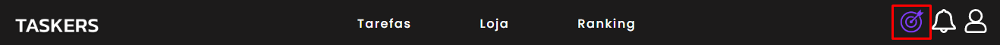

# Taskers

Taskers é uma aplicação de gerenciamento de tarefas.

- [Documentação da API](#documentação-da-api)
- [Documentação do Front-end](#documentação-do-front-end)

## OBJETIVO

Morar sozinho requer lidar com tarefas diárias e rotinas. A organização é essencial. Nossa aplicação serve como gerenciador de tarefas, permitindo criar, concluir e receber recompensas por meio de pontuações e conquistas

## Funcionalidades

- Gerenciamento de 3 tipos de tarefas
- Loja de cosméticos
- Customização de Perfil com cosméticos
- Classificação por ranking
- Notificações
- Missões Diárias
- Aplicação PWA para Mobile


## Tecnologias

- React Js
- Spring Boot
- PostgreSQL
- PWA
- Websocket
- Notificação nativa no browser
- Envio de email

## Documentação da API

### Autenticação
É necessário estar autenticado para realizar as demais ações da aplicação. Utilizamos o Basic Auth para realizar a autenticação do usuário.

#### Registra um usuário

```http
  POST /auth/registrar
```

| Parâmetro   | Tipo       | Descrição                           |
| :---------- | :--------- | :---------------------------------- |
| `nomeCompleto` | `string` | **Obrigatório**. Nome do usuário |
| `email` | `string` | **Obrigatório**. Email do usuário |
| `senha` | `string` | **Obrigatório**. Senha do usuário |
| `imagemPerfil` | `string` | **Opcional**. A url de uma imagem para usar no perfil do usuário |

#### Realiza login

```http
  POST /auth/login
```

| Parâmetro   | Tipo       | Descrição                           |
| :---------- | :--------- | :---------------------------------- |
| `username` | `string` | **Obrigatório**. O email do usuário |
| `password` | `string` | **Obrigatório**. A senha do usuário |

#### Realiza login com o Google
Quando logado com o Google, o usuário terá suas tarefas integradas com o Google Agenda.

```http
  /oauth2/authorization/google
```
Quando a rota é acessada, é disponibilizada uma página do Google onde é possivel efetuar o login.

#### Realiza logout

```http
  POST /auth/logout
```

#### Solicita nova senha

É enviado um email para o usuário, contendo um token para redefinição da senha.

```http
  POST /auth/esqueci-senha
```

| Parâmetro   | Tipo       | Descrição                           |
| :---------- | :--------- | :---------------------------------- |
| `email` | `string` | **Obrigatório**. Email do usuário |

#### Criar nova senha

Quando passado o token recebido no email como parâmetro, é possivel redefinir a senha.

```http
  PUT /auth/recuperar-senha/${token}
```

| Parâmetro | Tipo       | Descrição                                  |
|:----------| :--------- |:-------------------------------------------|
| `token`   | `string` | **Obrigatório**. Token recebido via email  |
| `senha`   | `string` | **Obrigatório**. Nova senha para o usuário |### Usuários

Quando autenticado, é possível realizar algumas ações com a conta do usuário logado.

#### Retorna o usuário detalhado

```http
  GET /usuarios/me
```
Retorna todas as informações importantes do usuário logado

#### Retorna o usuário resumido para validação

```http
  GET /usuarios/validar
```
Retorna as informações básicas do usuário logado, rota utilizada para validar login bem sucedido.

#### Altera dados do usuário

```http
  PUT /usuarios
```

| Parâmetro   | Tipo       | Descrição                           |
| :---------- | :--------- | :---------------------------------- |
| `nomeCompleto` | `string` | **Obrigatório**. Nome do usuário |
| `email` | `string` | **Obrigatório**. Email do usuário |
| `imagemPerfil` | `string` | **Opcional**. A url de uma imagem para usar no perfil do usuário |

#### Altera senha atual

```http
  PUT /usuarios/editar-senha
```

| Parâmetro   | Tipo       | Descrição                                  |
| :---------- | :--------- |:-------------------------------------------|
| `novaSenha` | `string` | **Obrigatório**. Nova senha para o usuário |
| `senhaAtual` | `string` | **Obrigatório**. Atual senha do usuário    |

### Hábitos

Hábitos são tarefas simples do dia-a-dia como beber água. Um hábito pode ser executado várias vezes pelo usuário, ou então desfazer uma execução caso queira.

#### Retorna os hábitos paginados e filtrados

```http
  GET /habitos?text=
```

| Parâmetro   | Tipo       | Descrição                           |
| :---------- | :--------- | :---------------------------------- |
| `text` | `string` | **Opcional**. O filtro do nome do hábito |

#### Retorna um hábito detalhado

```http
  GET /habitos/${id}
```

| Parâmetro   | Tipo       | Descrição                                   |
| :---------- | :--------- | :------------------------------------------ |
| `id`      | `int` | **Obrigatório**. O ID do hábito que você quer detalhar|

#### Inclui um hábito novo

```http
  POST /habitos
```

| Parâmetro   | Tipo       | Descrição                                                                            |
| :---------- | :--------- |:-------------------------------------------------------------------------------------|
| `nome`      | `string` | **Obrigatório**. O nome do hábito                                                    |
| `descricao`      | `string` | **Obrigatório**. A descrição do hábito                                               |
| `dificuldade`      | `string(enum)` | **Obrigatório**.A dificuldade do hábito. Escolha entre 'FACIL', 'MEDIO' ou 'DIFICIL' |


#### Altera um hábito

```http
  PUT /habitos/${id}
```

| Parâmetro   | Tipo       | Descrição                                   |
| :---------- | :--------- | :------------------------------------------ |
| `id`      | `int` | **Obrigatório**. O id do hábito que quer alterar|
| `nome`      | `string` | **Obrigatório**. O nome do hábito|
| `descricao`      | `string` | **Obrigatório**. A descrição do hábito|
| `dificuldade`      | `string(enum)` | **Obrigatório**.A dificuldade do hábito. Escolha entre 'FACIL','MEDIO' ou 'DIFICIL'|

#### Aumenta as execuções de um hábito

```http
  PUT /habitos/${id}/aumentar
```

| Parâmetro   | Tipo       | Descrição                                   |
| :---------- | :--------- | :------------------------------------------ |
| `id`      | `int` | **Obrigatório**. O id do hábito que quer aumentar a execução|

#### Deleta um hábito

```http
  DELETE /habitos/${id}
```

| Parâmetro   | Tipo       | Descrição                                   |
| :---------- | :--------- | :------------------------------------------ |
| `id`      | `int` | **Obrigatório**. O id do hábito que quer deletar|

### Diárias

Diárias são tarefas que possuem um horário e uma lista de dias definidos para serem realizadas. Uma diária pode ser realizada, mas à meia-noite dos dias definidos para ela, será reiniciada para ser realizada de novo.

#### Retorna as diárias paginadas e filtradas

```http
  GET /diarias?text=
```

| Parâmetro   | Tipo       | Descrição                           |
| :---------- | :--------- | :---------------------------------- |
| `text` | `string` | **Opcional**. O filtro do nome da diária |

#### Retorna uma diária detalhada

```http
  GET /diarias/${id}
```

| Parâmetro   | Tipo       | Descrição                                   |
| :---------- | :--------- | :------------------------------------------ |
| `id`      | `int` | **Obrigatório**. O ID da diária que você quer detalhar|

#### Inclui uma diária novo

```http
  POST /diarias
```

| Parâmetro   | Tipo       | Descrição                                   |
| :---------- | :--------- | :------------------------------------------ |
| `nome`      | `string` | **Obrigatório**. O nome da diária|
| `descricao`      | `string` | **Obrigatório**. A descrição da diária|
| `dificuldade`      | `string(enum)` | **Obrigatório**.A dificuldade da diária. Escolha entre 'FACIL','MEDIO' ou 'DIFICIL'|
| `hora`      | `string(localTime)` | **Obrigatório**. A hora que você deseja que a diária seja realizada|
| `dias`      | `array [int]` | **Obrigatório**. Um array que contenha o id dos dias que você deseja que a diária seja realizada|


#### Altera uma diária

```http
  PUT /diarias/${id}
```

| Parâmetro   | Tipo       | Descrição                                   |
| :---------- | :--------- | :------------------------------------------ |
| `id`      | `int` | **Obrigatório**. O id da diária que quer alterar|
| `nome`      | `string` | **Obrigatório**. O nome da diária|
| `descricao`      | `string` | **Obrigatório**. A descrição da diária|
| `dificuldade`      | `string(enum)` | **Obrigatório**.A dificuldade da diária. Escolha entre 'FACIL','MEDIO' ou 'DIFICIL'|
| `hora`      | `string(localTime)` | **Obrigatório**. A hora que você deseja que a diária seja realizada|
| `dias`      | `array [int]` | **Obrigatório**. Um array que contenha o id dos dias que você deseja que a diária seja realizada|

#### Realiza uma diária

```http
  PUT /diarias/${id}/realizar
```

| Parâmetro   | Tipo       | Descrição                                   |
| :---------- | :--------- | :------------------------------------------ |
| `id`      | `int` | **Obrigatório**. O id da diária que quer realizar|

#### Deleta uma diária

```http
  DELETE /diarias/${id}
```

| Parâmetro   | Tipo       | Descrição                                   |
| :---------- | :--------- | :------------------------------------------ |
| `id`      | `int` | **Obrigatório**. O id da diária que quer deletar|

### Afazeres

Afazeres são tarefas maiores e mais complexas, sendo realizadas apenas uma vez, como ir a uma reunião de negócios. Quando finalizada, um afazer permanecerá finalizado até você removê-lo.

#### Retorna os afazers paginados e filtrados

```http
  GET /afazeres?text=
```

| Parâmetro   | Tipo       | Descrição                           |
| :---------- | :--------- | :---------------------------------- |
| `text` | `string` | **Opcional**. O filtro do nome do afazer |

#### Retorna um afazer detalhado

```http
  GET /afazeres/${id}
```

| Parâmetro   | Tipo       | Descrição                                   |
| :---------- | :--------- | :------------------------------------------ |
| `id`      | `int` | **Obrigatório**. O ID do afazer que você quer detalhar|

#### Inclui um afazer novo

```http
  POST /afazeres
```

| Parâmetro   | Tipo       | Descrição                                   |
| :---------- | :--------- | :------------------------------------------ |
| `nome`      | `string` | **Obrigatório**. O nome do afazer|
| `descricao`      | `string` | **Obrigatório**. A descrição do afazer|
| `dificuldade`      | `string(enum)` | **Obrigatório**.A dificuldade do afazer. Escolha entre 'FACIL','MEDIO' ou 'DIFICIL'|


#### Altera um afazer

```http
  PUT /afazeres/${id}
```

| Parâmetro   | Tipo       | Descrição                                   |
| :---------- | :--------- | :------------------------------------------ |
| `id`      | `int` | **Obrigatório**. O id do afazer que quer alterar|
| `nome`      | `string` | **Obrigatório**. O nome do afazer|
| `descricao`      | `string` | **Obrigatório**. A descrição do afazer|
| `dificuldade`      | `string(enum)` | **Obrigatório**.A dificuldade do afazer. Escolha entre 'FACIL','MEDIO' ou 'DIFICIL'|

#### Finaliza um afazer

```http
  PUT /afazeres/${id}/finalizar
```

| Parâmetro   | Tipo       | Descrição                                   |
| :---------- | :--------- | :------------------------------------------ |
| `id`      | `int` | **Obrigatório**. O id do afazer que quer finalizar|


#### Deleta um afazer

```http
  DELETE /afazeres/${id}
```

| Parâmetro   | Tipo       | Descrição                                   |
| :---------- | :--------- | :------------------------------------------ |
| `id`      | `int` | **Obrigatório**. O id do afazer que quer deletar|

### Cosméticos

Cosméticos são itens colecionáveis que podem ser comprados utilizando Taskcoins (recompensas das Missões Diárias) e então podem ser vistas no perfil do usuário. Você inicia com cosméticos padrões, mas eles podem ser editados quando você quiser.

#### Retorna os Cosméticos Disponíveis paginados
Os cosméticos não comprados pelo usuário são chamados de "Disponíveis".
```http
  GET /cosmeticos/disponiveis?size=50
```

#### Retorna os Cosméticos Adquiridos paginados
Os cosméticos comprados pelo usuário são chamados de "Adquiridos".
```http
  GET /cosmeticos/adquiridos?size=50
```

#### Retorna os Cosméticos Equipados
Lista os 4 cosméticos que foram equipados pelo usuário.
```http
  GET /cosmeticos/equipados
```

#### Compra um cosmético
Caso você possua Taskcoins suficientes para comprar o cosmético, ele irá para a lista de Cosméticos Adquiridos.
```http
  POST cosmeticos/${id}/comprar
```

| Parâmetro   | Tipo       | Descrição                                   |
| :---------- | :--------- | :------------------------------------------ |
| `id`      | `int` | **Obrigatório**. O id do cosmético que quer comprar|

#### Equipa um cosmético
Caso o cosmético esteja na sua lista de Cosméticos Adquiridos, ele irá ser equipado.
```http
  PUT cosmeticos/${id}/equipar
```

| Parâmetro   | Tipo       | Descrição                                   |
| :---------- | :--------- | :------------------------------------------ |
| `id`      | `int` | **Obrigatório**. O id do cosmético que quer equipar|

### Missões Diárias
Missões diárias são missões relacionadas a suas tarefas criadas. Cada missão irá ter um objetivo de realizar um determinado número de vezes alguma de suas tarefas. Ao completar uma missão diária o usuário recebe experiência e Taskcoins. Missões diárias são reiniciadas todo dia à meia-noite.

#### Retorna as missões Diárias
```http
  GET /missoes
```
### Dias
Os dias são informações necessárias para as Diárias. Cada dia possui um id e seu respectivo nome. Os dias são usados para incluir ou alterar diárias.

#### Retorna os dias da semana
```http
  GET /dias
```
### Notificações
Notificações são enviadas ao usuário para avisar que alguma diária deve ser realizada. Elas são enviadas sempre que bate o horário marcado na diária em específico. Notificações podem ser enviadas para o email do usuário.


#### Retorna as notificações
```http
  GET /notificacoes
```

#### Ativa ou desativa as notificações por email.
```http
  PUT /notificacoes/email
```

#### Notificações pelo WebSocket
As notificações aparecem em tempo real para o usuário caso seja ativado a rota pelo WebSocket.
```http
  WS /ws
```
Rota direcionada ao usuário autenticado, onde pode receber as notificações de forma privada.
```http
  /user/notificacao
```

#### Deleta uma notificação

```http
  DELETE /notificacoes/${id}
```

| Parâmetro   | Tipo       | Descrição                                   |
| :---------- | :--------- | :------------------------------------------ |
| `id`      | `int` | **Obrigatório**. O id da notificação que quer deletar|

### Ranking
Cada usuário possuirá uma posição no Ranking geral do Taskers. A posição no Ranking é calculada através da quantidade de experiência que o usuário possui.

#### Retorna o ranking
```http
  GET /ranking?nome=
```
### Conquistas
Ao concluir um determinado objetivo, o usuário irá concluir uma conquista. As conquistas são objetivos relacionados às ações que o usuário realiza na aplicação, como criar tarefas, executá-las, comprar cosméticos, e concluir missões diárias.

#### Retorna as conquistas do usuário
```http
  GET /conquistas?size=25
```

## Documentação do Front-end

## Instalação
Para realizar a instalação do projeto front-end na sua máquina, realize esses comandos:

### Instalar App
```http
  $ git clone https://git.cwi.com.br/crescer/2023-01/TCC/madrid.git
  $ cd madrid
  $ npm install
```

### Iniciar App
Com o projeto instalado, realize esse comando para iniciar o projeto.

```http
  $ npm start
```

## Tela Login
A tela de login é a tela inicial da aplicação, nela o usuário poderá se logar com uma conta nativa da aplicação ou então com uma conta Google. Além disso você poderá se registrar com uma conta nativa nova, e caso perder a senha poderá recuperá-la.


### Login nativo
O login nativo é realizado com os dados do email do usuário e sua senha.


### Login com Google
O login com google te redireciona para uma página google onde você entrará com seu email Google já criado.


### Recuperar a senha
Para recuperar a senha, clique na opção "Esqueceu a senha?" e você abrirá um modal onde deverá colocar seu email onde será enviado o link de recuperação.


## Tela Cadastro
Essa tela tem o objetivo de criar um usuario novo no Taskers em uma conta nativa da aplicação.


### Registrar usuário
Você deverá informar os dados de Nome Completo, Email, Senha e foto de perfil (opcional). E após isso clicar no botão "Cadastrar"


## Tela Tarefas
A tela de tarefas é a tela principal do Taskers, nela o usuário poderá criar um dos 3 tipos de tarefas e organizá-las.

### Acessar Tela
Para acessar a tela de tarefas você deve clicar na opção "Tarefas" no header da aplicação


### Criando tarefas
Para criar qualquer tipo de tarefa, clique no botão com um + no respectivo tipo de tarefa.

Após isso você deve inserir os dados da tarefa e clicar no botão "criar".

### Detalhando tarefa
Para detalhar qualquer tarefa, clique na área do titulo da tarefa


### Alterando tarefa
Para alterar alguma tarefa, clique no seguinte botão no modal de Detalhar Tarefa (mostrado acima)


Após isso altere os dados que quiser


### Excluido tarefa
Para excluir alguma tarefa, clique no seguinte botão no modal de Detalhar Tarefa (mostrado acima). Assim a tarefa será excluida na hora


### Executar tarefas
Para executar as tarefas é simples, vá até a tarefa que deseja executar e clique no respectivo botão de execução. No caso dos hábitos é o botão circular com um + no lado direito, já nas diárias e afazeres é no quadrado ao lado esquerdo


### Pesquisar tarefas
Para pesquisar alguma tarefa, clique na lupa presente no canto superior esquerdo da seção da tarefa escolhida.

Após isso insira o filtro que desejar

## Tela de Perfil
A tela de perfil é a tela onde ficam as informações da conta do usuário, como nome, experiência e Taskcoins. Além de trazer opções de alteração do perfil.


### Acessar Tela
Para acessar a essa tela clique no botão com ícone de usuário no canto superior direito.


### Alterar senha
Para alterar a senha do perfil clique na opção "Alterar senha"


Após abrir o modal, insira os dados da nova senha e clique em "Enviar"


### Desativar ou ativar notificações por email
Para ativar ou desativar as notificações por email, clique nessa opção.


### Logout
Para deslogar da sua conta atual, clique na opção de "Logout"


## Tela de Conquistas
As conquistas são parte fundamental na gamificação do Taskers, na tela de Conquistas você poderá encontrar as conquistas em progresso e concluídas.


### Acessar tela
Para acessar essa tela, clique na opção "Visualizar Conquistas" na tela de Perfil.


### Conquista em progresso


### Conquista concluída


## Tela de Editar Cosméticos
A tela de Editar Cosméticos é onde você poderá customizar seus cosméticos equipados que serão visualizados no perfil. Nessa tela você terá os cosméticos adquiridos para escolher qual equipar, além de visualizar os equipados atualmente.


### Acessar a tela
Para acessar essa tela clique na opção "Editar Cosméticos" na tela de Perfil.


### Equipar cosméticos
Para equipar o cosmético que quiser, clique na caixa onde a imagem do respectivo cosmético está, assim ele será equipado. Obs. Cosméticos já equipados ficam com suas opções bloqueadas pois já estão em uso.


### Filtrar cosméticos
Você pode filtrar os cosméticos pelo tipo deles. Para abrir o filtro clique na opção "Filtro" no canto superior direito da seção de equipar cosméticos.


Após isso clique no filtro que desejar


## Tela de Alterar Perfil
Essa tela é onde você poderá alterar seus dados da conta. Obs. Essa tela só está disponível para contas nativas do Taskers.


### Acessar a tela
Para acessar essa tela clique na opção "Editar Perfil" na tela de Perfil.


### Alterando dados
Para alterar os dados da conta informe os novos dados nos seus respectivos inputs. Após isso clique em "Editar Perfil"


## Tela de Ranking
A tela de Ranking é onde você poderá ver a posição no ranking de todos os usuários da aplicação. Nele você visualizará o nome, a posição e quantidade de experiência dos usuários.


### Pesquisando usuários
Você pode pesquisar usuários no ranking clicando na lupa no canto superior direito da seção de ranking.


Após isso escreva o filtro que desejar relacionado ao nome do usuário pesquisado.


## Tela da Loja
A tela da Loja é onde você encontrará os cosméticos disponíveis para compra utilizando as Taskcoins. São 50 cosméticos diversos entre plantas, cenários, pets e roupas. Nela você também irá visualizar sua quantidade atual de Taskcoins.


### Acessar a tela
Para acessar essa tela clique na opção "Loja" no header da aplicação


### Comprar cosméticos
Para comprar um cosmético é simples, vá até o cosmético que queira e clique no botão circular com um +.


Após isso clique no botão comprar


Obs. Caso você não tenha moedas o suficiente você irá receber um aviso e não poderá efetuar a compra.


### Filtrar cosméticos
Você pode filtrar os cosméticos pelo tipo deles. Para abrir o filtro clique na opção "Filtro" no canto superior direito da seção de equipar cosméticos.


Após isso clique no filtro que desejar


## Barra de missões
A Barra de Missões é onde você irá visualizar as missões diárias atuais.


### Acessar a tela
Para acessar essa tela clique no ícone em formato de alvo no header da aplicação



## Barra de notificações
A Barra de notificações é onde você irá visualizar as notificações atuais.


### Acessar a tela
Para acessar essa tela clique no ícone em formato de sino no header da aplicação


### Apagar notificações
Para apagar alguma notificação, clique no botão com ícone de lixeira ao lado direito da notificação


## PWA
PWA é uma funcionalidade na intenção de aperfeiçoar a utilização do app em um dispositivo mobile. Para utilizar do PWA siga os seguintes passos:

#### 1. Acesse a aplicação em um dispositivo mobile.


#### 2. Clique nos 3 pontinhos no canto superior direito do navegador.


#### 3. Escolha a opção "Adicionar à tela inicial" ou similar.


#### 4. Escolha um nome e clique em "Adicionar".


#### 5. Acesse a aplicação direto na sua tela inicial do mobile.


## Dependências
A aplicação utiliza de algumas dependências para melhorar a aplicação.

### Prettier
Prettier é uma ferramente que utilizamos para organizar melhor nosso código de forma automática.
 - [Documentação](https://prettier.io/docs/en/index.html)
### React-Toastify
O React-Toastify foi utilizado para a criação de toasters.
 - [Documentação](https://fkhadra.github.io/react-toastify/introduction)
### React-Modal
O React-Modal foi utilizado para facilitar a criação de modals na aplicação
 - [Documentação](https://reactcommunity.org/react-modal/)
### StompJS
StompJS é uma lib que provê um cliente STOMP utilizando o websocket. Foi utilizado na parte de websocket das notificações.
 - [Documentação](https://github.com/jmesnil/stomp-websocket)
## Documentação de Cores
Durante o design do Taskers utilizamos de uma paleta de cores principal para colorir as partes principais da aplicação. Aqui está a paleta utilizada:

| Cor               | Hexadecimal                                                |
| ----------------- | ---------------------------------------------------------------- |
| Branco       |  #ffffff |
| Cinza Fraco       |  #f8f8f8 |
| Cinza       |  #989898 |
| Cinza Escuro       |  #434343 |
| Roxo Fraco       |  #7f3bfa |
| Roxo       |  #6121d6 |
| Roxo Escuro       |  #3f1e7e |
| Preto       |  #1c1b1b |


### FAQ

### - A aplicação é responsiva?
Sim, a aplicação está responsiva em vários aspectos para melhorar a utilização em dispositivos mobile.

#### Comecei minha conta no Taskers, mas não recebi as missões diárias.
As missões diárias são selecionadas aleatoriamente todo dia no horário da meia-noite. Caso você tenha iniciado sua conta a pouco tempo, as missões não serão selecionadas. Caso você também não possua nenhuma tarefa cadastrada, novas missões também não serão selecionadas.

#### Como faço para colocar as tarefas no Google Agenda?
Caso você tenha logado com o Google, as tarefas quando incluídas no Taskers serão automaticamente incluídas no Google Agenda.

#### Não consegui logar com o Google.
A aplicação está em fase de testes, por isso apenas emails específicos podem se logar com a API do Google.
